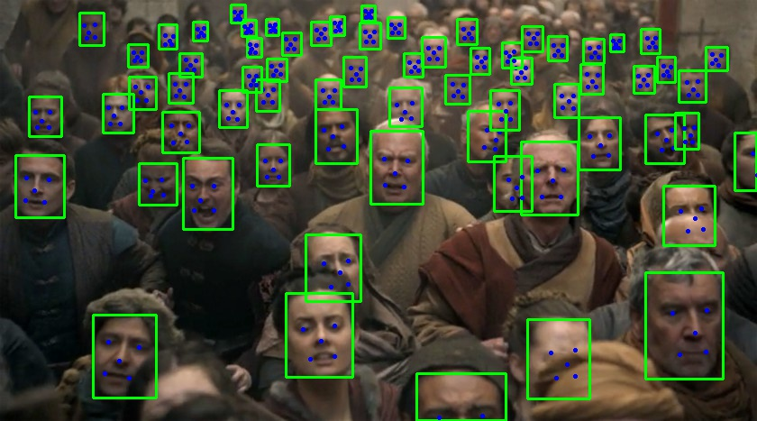

# facial-rec



Demonstration of some pretty good facial rec tech using a 
[famous selfie](dataset/goup-pic.JPG) with a 
[bunch of stars](dataset). 


TL/DR - jump to [results](docs/results.md)


## How It Works

At a high level, facial recognition consists of two steps: detection and embedding.

Detection takes a large image and produces a list of faces in the image.  This piece is
generally uses fully-convolutional approaches which means they take an input image
and output an output 'image' where each pixel consists of generally a bounding box,
and confidence measure, and a set of landmarks.  A second step does
non-maximal-suppression of the data which is a fancy way of saying it looks at
overlaps and takes the highest confidence one.

From here we get a list of faces and landmarks.  We crop the faces out of the
source image and align them using the landmarks to a set of 'standard' landmarks
used during training.


The next step is to produce an embedding which is an N-dimensional vector.  In our
case that vector has 512 elements.  These vectors have a special property that
faces that look more similar will be closer in Euclidean space.  So for example
if I have two images of Tom Hanks and I create two embeddings I would expect the
distance between them to be less than the distance between say, an image of Tom Hanks
and an image of Denzel Washington.


One of the most interesting aspects to me is that I can use a deep learning
system to construct a [metric space](https://en.wikipedia.org/wiki/Metric_space)
where distance corresponds to something very abstract like how similar these two 
people appear are or how how similar these two outfits are.  In this sense the
target of our learning algorithm is a good embedding in our new space.


That is it.  That is how facial rec works at the base level.  Training these two
components is an area of research in and of itself and is way out of scope of an
example of using the systems.  But, if you ever wondered roughly how facial rec
works the above description provides a good outline of most systems.


## Usage


This system is built to show a realistic example of a cutting-edge system.  As such
it rests on four components:
1.  docker
2.  Conda
3.  Python
4.  Clojure


The most advanced piece of the demo is actually the facial detection component.
Luckily, it was nicely wrapped.  To get it working we needed cython working and
there is some [good information](src/facial_rec/detect.clj) there if you want to
use a system that is based partially on cython.


### Get the data

This script mainly downloads the models used for detection and feature embedding.

```console
scripts/get-data
```


### Start up a REPL


```console
scripts/run-conda-docker
```

The port is printed out in a line like:

```console
nREPL server started on port 44507 on host localhost - nrepl://localhost:44507
```

Now in emacs, vim or somewhere connect to the
exposed port on locahost.


### Find/Annotate Faces


```clojure
(require '[facial-rec.demo :as demo])
;;long pause as things compile
```

At this point, we have to say that the system is dynamically compiling cython and
upgrading the networks to the newest version of mxnet.  This is a noisy process
for a few reasons; we are loading a newer numpy, compiling files and loading networks.
You will see warnings in the repl and your stdout of your docker will display
some errors regarding compiling gpu non maximal suppression (nms) algorithms:
```console
In file included from /home/chrisn/.conda/envs/pyclj/lib/python3.6/site-packages/numpy/core/include/numpy/ndarraytypes.h:1832:0,
                 from /home/chrisn/.conda/envs/pyclj/lib/python3.6/site-packages/numpy/core/include/numpy/ndarrayobject.h:12,
				                  from /home/chrisn/.conda/envs/pyclj/lib/python3.6/site-packages/numpy/core/include/numpy/arrayobject.h:4,
								                   from /home/chrisn/.pyxbld/temp.linux-x86_64-3.6/pyrex/rcnn/cython/gpu_nms.c:598:
												   /home/chrisn/.conda/envs/pyclj/lib/python3.6/site-packages/numpy/core/include/numpy/npy_1_7_deprecated_api.h:17:2: warning: #warning "Using deprecated NumPy API, disable it with " "#define NPY_NO_DEPRECATED_API NPY_1_7_API_VERSION" [-Wcpp]
												    #warning "Using deprecated NumPy API, disable it with " \
													  ^~~~~~~
													  /home/chrisn/.pyxbld/temp.linux-x86_64-3.6/pyrex/rcnn/cython/gpu_nms.c:600:10: fatal error: gpu_nms.hpp: No such file or directory
													   #include "gpu_nms.hpp"
													             ^~~~~~~~~~~~~
```

Interestingly enough, the system still works fine.  The nms errors are around building
the gpu version of the nms algorithms and we aren't using the gpu for this demo.


Moving On!!


```clojure
(def faces (find-annotate-faces!))
;;...pause...
#'faces
```

Now there are cutout faces in the faces subdir.
You can do nearest searches in the demo namespace and
see how well this network does.


```clojure
(output-face-results! faces)
```

This takes each face, find the 5 nearest, and outputs the results to a markdown
file.  We use `grip` to view the markdown files locally.


Going further, any non-directory files in the dataset directory will be scanned and
added to the dataset so feel free to try it with your friends and family and see
how good the results are.


## License

Copyright © 2019 Chris Nuernberger

This program and the accompanying materials are made available under the
terms of the Eclipse Public License 2.0 which is available at
http://www.eclipse.org/legal/epl-2.0.
